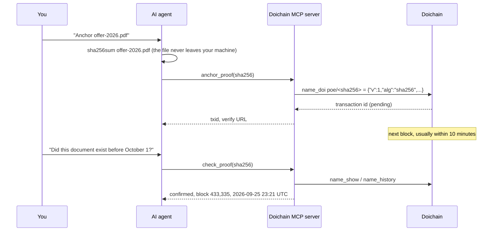

<p align="center">
  
</p>

<h1 align="center">Doichain MCP Server</h1>

<p align="center">
  <strong>Turn your AI agent into a blockchain notary.</strong><br>
  Anchor documents tamper-proof on the Doichain, verify proofs of existence and read names, blocks and addresses.<br>
  One URL, no account, no API key, no installation.
</p>

<p align="center">
  <a href="https://registry.modelcontextprotocol.io/v0/servers?search=io.github.neubuot/doichain"></a>
  <a href="https://doi-api.sendlabs.de/mcp"></a>
  <a href="https://github.com/neubuot/doichain-mcp/actions/workflows/ci.yml"></a>
  <a href="LICENSE"></a>
  
  
</p>

<p align="center">
  <a href="#quick-start">Quick start</a> ·
  <a href="#tools">Tools</a> ·
  <a href="#how-a-proof-of-existence-works">How it works</a> ·
  <a href="#limits-and-quotas">Limits</a> ·
  <a href="#security-and-privacy">Security</a> ·
  <a href="docs/tools.md">Tool reference</a> ·
  <a href="docs/self-hosting.md">Self-hosting</a> ·
  <a href="README.de.md">Deutsch</a>
</p>

---

**Endpoint:** `https://doi-api.sendlabs.de/mcp` · Streamable HTTP · stateless · no authentication required

The [Doichain](https://www.doichain.org/en/) is a public blockchain with a built-in name-value store (a Namecoin descendant, merge-mined with Bitcoin). This server makes it usable for any agent that speaks the [Model Context Protocol](https://modelcontextprotocol.io): Claude, ChatGPT, Cursor, VS Code Copilot and many more. Ask your agent in plain language, it picks the right tool itself:

> *"Anchor the hash of offer-2026.pdf on the Doichain."*
> *"Did this contract already exist before October 1?"*
> *"Are d/example or id/alice about to expire?"*
> *"How is the Doichain doing right now?"*

Opening the endpoint in a browser shows the [landing page](https://doi-api.sendlabs.de/mcp) with setup instructions.

## Quick start

### Claude Code

```bash
claude mcp add --scope user --transport http doichain https://doi-api.sendlabs.de/mcp
```

Check with `claude mcp list`. Without `--scope user` the server only applies to the current project.

### Claude (web and desktop)

1. Open **Customize → Connectors** and click **+**.
2. Choose **Add custom connector**, name it `Doichain` and paste `https://doi-api.sendlabs.de/mcp`.
3. In a chat, enable it via **+ → Connectors**.

Custom connectors also work on the free plan (one connector). On Team and Enterprise an owner adds it in the organization settings.

### ChatGPT

Turn on **Settings → Security and login → Developer mode**, then create an app under **Plugins → +** with the URL above and authentication **None**. Developer mode is available on the web for Plus, Pro, Business, Enterprise and Education.

### Cursor

`~/.cursor/mcp.json` (all projects) or `.cursor/mcp.json` (one project):

```json
{
  "mcpServers": {
    "doichain": { "url": "https://doi-api.sendlabs.de/mcp" }
  }
}
```

### VS Code (Copilot agent mode)

`.vscode/mcp.json`:

```json
{
  "servers": {
    "doichain": { "type": "http", "url": "https://doi-api.sendlabs.de/mcp" }
  }
}
```

### Any other client

| Setting | Value |
|---|---|
| URL | `https://doi-api.sendlabs.de/mcp` |
| Transport | Streamable HTTP (`http` / `streamable-http`), stateless, JSON responses |
| Authentication | none, optionally your own key in the `X-API-Key` header |
| Protocol versions | 2024-11-05, 2025-03-26, 2025-06-18, 2025-11-25, 2026-07-28 |

Try it without an AI client using the [MCP Inspector](https://github.com/modelcontextprotocol/inspector): `npx @modelcontextprotocol/inspector`, choose *Streamable HTTP* and enter the URL. A small Python example is in [`examples/check_proof.py`](examples/check_proof.py).

## Tools

| Tool | What it does | Access |
|---|---|---|
| `anchor_proof` | Anchor the SHA-256 of a document as proof that it exists now (name `poe/<sha256>`). Already anchored hashes return the existing proof. | writes |
| `check_proof` | Is this hash anchored, since when, in which block? Reports the first anchoring even if an expired proof was anchored again. | reads |
| `hash_text` | SHA-256 of a short text (up to 40,000 characters), computed on the server, nothing stored. | server-side |
| `get_anchoring_quota` | Proofs still available today for the caller's IP address. | reads |
| `lookup_name` | Current value, owner and expiry of a name such as `d/example` or `id/alice`. | reads |
| `get_name_history` | Every registration and update of a name, newest first. | reads |
| `check_name_expiry` | Up to 25 names at once: active, expiring soon, expired or free, with dates. | reads |
| `search_names` | Names by prefix (for example all `poe/` proofs), with paging. | reads |
| `get_chain_status` | Block height, sync state, last block, fork check, average block interval. | reads |
| `get_block` | A block by height or hash. | reads |
| `get_transaction` | A transaction with outputs, addresses and name operations. | reads |
| `get_address` | Balance of an address, optionally with recent transactions. | reads |
| `verify_message` | Check a message signed with a Doichain address (legacy `M…`/`N…` addresses). | reads |

All tools return structured JSON (`structuredContent`) and carry MCP tool annotations. Only `anchor_proof` is not read-only. Parameters, return fields and examples: **[docs/tools.md](docs/tools.md)**.

## How a proof of existence works



Only the hash, and optionally a public note or file name, goes on chain. A SHA-256 cannot be turned back into the document. Anyone can verify a proof later with `check_proof` or on [verifile.it](https://verifile.it/), and changing a single byte of the document produces a different hash. The name `poe/<sha256>` stays active for 36,000 blocks (roughly seven months), the anchoring transaction and its timestamp stay in the blockchain for good.

Agents need access to the file to hash it (Claude Code, Cursor, VS Code). In a plain chat, [Verifile](https://verifile.it/) is the easiest way: drop the file, it is hashed in the browser and anchored with one click.

## Limits and quotas

| Limit | Value |
|---|---|
| Anchoring | free for users, 10 proofs per IP address per UTC day, at most 200 per day for all users together |
| Requests | 10 per second per IP address (burst 40), JSON-RPC error `-32000` with `Retry-After: 1` when exceeded |
| Request size | 256 KB, `hash_text` up to 40,000 characters |
| Reading and checking | unlimited within the request rate |

Hosted chat apps (Claude on the web, ChatGPT) connect from their providers' data centers, so all their users share the quota of those addresses. For regular anchoring use a client that connects from your own machine (Claude Code, Cursor, VS Code) or ask DOI Labs for an own key. Anchoring pauses automatically when the operating balance of the node wallet falls below a reserve, reading keeps working.

## Security and privacy

- **Hashes only.** The server accepts no files. `hash_text` sees a short text and forgets it immediately.
- **No wallet functions.** The server cannot send coins, change names or call node RPCs. It runs as a separate service under its own system user, without read access to the API's key file, and may only open local connections.
- **Prompt injection protection.** Names and values written to the chain by strangers are returned in fields ending in `_untrusted` together with a notice, and the server instructions tell agents to treat them as data only.
- **DNS rebinding protection.** Host and Origin headers are validated.
- **No tracking.** No cookies, no third-party resources on the landing page. Like any web server, IP addresses appear in access logs and count toward the daily quota. Content is not stored.

Found a vulnerability? Please use [private vulnerability reporting](https://github.com/neubuot/doichain-mcp/security/advisories/new), see [SECURITY.md](SECURITY.md).

## Protocol behavior

- Streamable HTTP in stateless mode with JSON responses, so any number of workers can serve requests without session affinity.
- `POST /mcp` for all MCP messages. `GET /mcp` from a browser returns the landing page, any other `GET` or `HEAD` returns `405` with `Allow: POST` (there is no server-to-client SSE stream in stateless mode).
- No JSON-RPC batches (removed from the protocol in 2025-06-18). No CORS, so clients running directly inside a web page are not supported.
- `GET /mcp/health` for monitoring.

## Architecture

```
AI agent ──HTTPS──▶ nginx ──▶ doichain-mcp (this repo, 127.0.0.1:8081)
                                  │  REST calls only, client IP passed on for the quota
                                  ▼
                          Doichain REST API (127.0.0.1:8080) ──▶ Doichain Core v31.1.6 + ElectrumX
```

The MCP server is a thin, stateless layer over the [Doichain REST API](https://doi-api.sendlabs.de/) ([interactive docs](https://doi-api.sendlabs.de/docs)), which runs next to a full Doichain Core node. See [docs/self-hosting.md](docs/self-hosting.md) to run your own instance.

## Development

```bash
python -m venv .venv
. .venv/bin/activate          # Windows: .venv\Scripts\activate
pip install -e ".[dev]"
pytest -q                     # offline tests, the REST API is mocked
ruff check .

# run locally against the public REST API (reading works, anchoring needs your own key)
DOI_MCP_API_URL=https://doi-api.sendlabs.de python -m doichain_mcp
npx @modelcontextprotocol/inspector   # connect to http://127.0.0.1:8081/mcp
```

Releases follow semantic versioning. Pushing a tag `vX.Y.Z` runs the tests and publishes `server.json` to the [official MCP Registry](https://registry.modelcontextprotocol.io) via GitHub Actions (OIDC, no secrets). The tag, `server.json` and `pyproject.toml` must carry the same version. See [CONTRIBUTING.md](CONTRIBUTING.md) and [CHANGELOG.md](CHANGELOG.md).

## Related

- [Verifile](https://verifile.it/): proof of existence by drag and drop, no upload
- [Doichain REST API](https://doi-api.sendlabs.de/): the HTTP interface behind this server, with a live playground
- [Doichain Core](https://github.com/Doichain/doichain-core): the reference node
- [Doichain Explorer](https://doi-explorer.le-space.de): blocks, transactions and names

## License and operator

[MIT](LICENSE) © 2026 DOI Labs AG. The hosted endpoint is operated by [DOI Labs](https://www.doichain.org/en/), [legal notice](https://www.doichain.org/en/imprint/).
